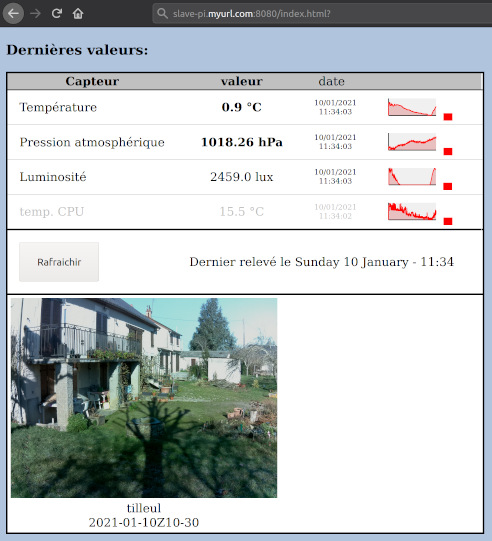
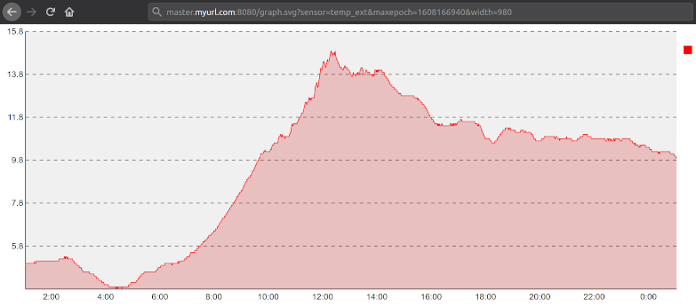
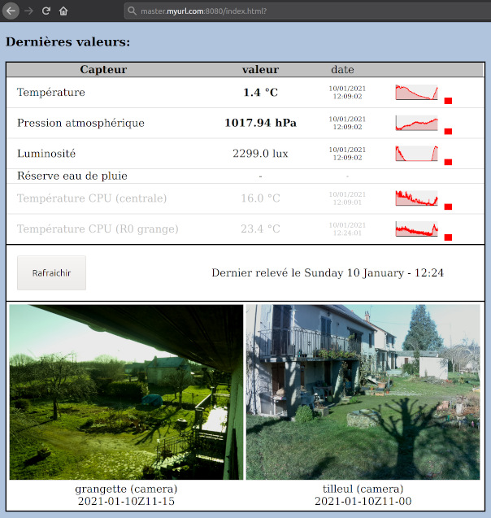

# Weather station with Raspberry Pi

Webserver hosting a weather station, built on top of a Raspberry Pi (eventually a 0) with weather sensors.
- data history
- consulting data through web interface
- webcam optional

# Installation

With a raspian (simple 'Raspbian * Lite' ok):
1. login to console
2. (launch command line "sudo apt install git" of course...) 
3. clone this repository with "git clone https://github.com/Thomas-Baeckeroot/meteo.git"
4. launch "sudo meteo/install.sh" and follow the instructions...

# Technical details

Sensor reading is written in **Python 3**, it is triggered every minute with simple **cron**.
Webserver is **Python 3** (graphs with svg.charts).
Data are stored in **MariaDB** database.

Configuration with multiple Raspberrys Pis are possible, a "master" copying data from a slave,
making possible presentation of data from a distant Pi 0 for example, on another Pi 4.
As much as possible, things have been kept simple so that it is possible to install webserver on a NAS
(Synology DSxxx, etc...), getting values and picture from remote Raspberrys:

# GPIO pins used for my personal configuration...

Configuration is either in ~/.config/susanoo_WeatherStation.conf or in table *sensors" of database.

|                     |                         |     |     |                         |                   |
|--------------------:| -----------------------:|:---:|:---:|:----------------------- |:------------------|
|                     |                   3.3V  | ` 1`| ` 2`|  5V                     |                   |
|             Sensors |**SDA < I2C** /~~GPIO 2~~| ` 3`| ` 4`|  5V                     |                   |
|  Temp./humidity/... |**SCL < I2C** /~~GPIO 3~~| ` 5`| ` 6`|  GND                    |                   |
|                     |               **GPIO 4**| ` 7`| ` 8`|**GPIO 14** / UART > TXD |                   |
|                     |                    GND  | ` 9`| `10`|**GPIO 15** / UART > RXD |                   |
|                     |              **GPIO 17**| `11`| `12`|**GPIO 18** / PCM > CLK  | Mvt detector (in) |
|                     |              **GPIO 27**| `13`| `14`|  GND                    |                   |
|(distance sensor-out)|              **GPIO 22**| `15`| `16`|**GPIO 23**              |(distance sensor-in)|
|                     |                   3.3V  | `17`| `18`|**GPIO 24**              |                   |
|                     | MOSI < SPI / **GPIO 10**| `19`| `20`|  GND                    |                   |
|                     | MISO < SPI /  **GPIO 9**| `21`| `22`|**GPIO 25**              | Watchdog LED - green blink (out)   |
|                     | SCLK < SPI / **GPIO 11**| `23`| `24`|**GPIO 7**               |                   |
|                     |                    GND  | `25`| `26`|**GPIO 8**               |                   |
|                     |                   ID SD | `27`| `28`|  ID SC                  |                   |
|                     |               **GPIO 5**| `29`| `30`|  GND                    |                   |
|         relay (out) |               **GPIO 6**| `31`| `32`|**GPIO 12**              | btn (in)          |
|         relay (out) |              **GPIO 13**| `33`| `34`|  GND                    |                   |
| CPU fan relay (out) |   FS < PCM / **GPIO 19**| `35`| `36`|**GPIO 16**              | btn (in)          |
|         relay (out) |              **GPIO 26**| `37`| `38`|**GPIO 20** / PCM > DIN  | btn (in)          |
|                     |                    GND  | `39`| `40`|**GPIO 21** / PCM > DOUT | Shutdown btn (in) |

